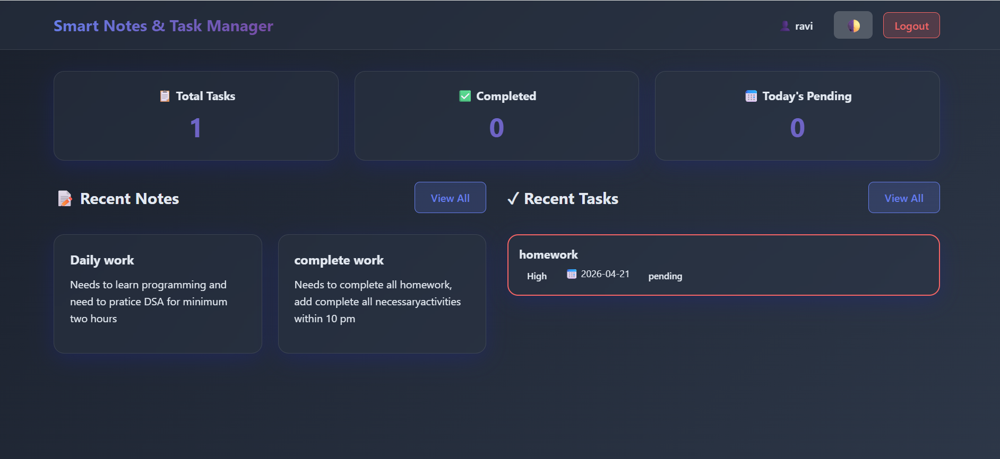

# Smart Notes & Task Manager

A highly premium, locally-run productivity workspace featuring built-in AI Heuristics, Voice Dictation, and deep focus methodologies wrapped in a modern Deep Midnight Glassmorphism UI.

## 📸 Screenshot

*(Add your screenshot here! Replace `path/to/screenshot.png` with the actual file name you upload. It's best to place the image in the `static` folder)*


## ✨ Premium Features

This project stands out from standard CRUD applications by implementing several unique, offline-first features natively in the browser and backend:

*   **🎙️ Hands-Free Voice Dictation:** Integrated with the native `Web Speech API`, allowing users to dictate notes smoothly without typing.
*   **🧠 Smart Workspace (Local NLP AI):** An embedded custom Python natural language processing heuristic. Click "Analyze" on any note to automatically extract a concise summary, detect hidden action items ("I need to..."), and auto-generate tags without relying on expensive external APIs.
*   **🎯 Zen Focus Mode:** A distraction-free, full-screen Pomodoro timer directly linked to your pending tasks to enforce productivity. 
*   **🔒 Secure Authentication:** A full user authentication system utilizing secure password hashing.
*   **📌 Comprehensive Note-Taking:** Create, edit, delete, and pin important notes to the top of your dashboard.
*   **✅ Intelligent Task Manager:** Track tasks by priority, set due dates, and easily monitor overdue items with automatic visual flags.
*   **🎨 Premium Aesthetics:** A gorgeous "Deep Midnight" glassmorphism interface with Google's Outfit typography, designed for maximum legibility and cinematic aesthetics.

## 🚀 Tech Stack

*   **Backend:** Python 3, Flask, SQLite3
*   **Frontend:** Vanilla JavaScript, HTML5, Vanilla CSS3 (Custom Glassmorphism Design System)
*   **Security:** Werkzeug Security (Bcrypt Hash), CSRF Token implementation.

## 🛠️ Installation & Setup

1. **Prerequisites:** Ensure you have Python 3.11+ installed.
2. **Setup Virtual Environment:**
   ```bash
   python -m venv venv
   source venv/bin/activate  # On Windows use: venv\Scripts\activate
   ```
3. **Install Dependencies:**
   ```bash
   pip install flask werkzeug
   ```
4. **Run the Application:**
   ```bash
   python -m flask run
   ```
   *(Alternatively, run `python app.py`)*
5. **Access the Application:** Open your modern web browser (Chrome recommended for Dictation support) and navigate to `http://127.0.0.1:5000/`.

## 💡 Showcase

This application is designed as a standout piece for developer portfolios. Its combination of Custom NLP algorithms, native browser APIs (Speech Recognition), and a meticulous CSS architecture demonstrates a solid grasp of complete full-stack web development extending well beyond standard tutorials.
